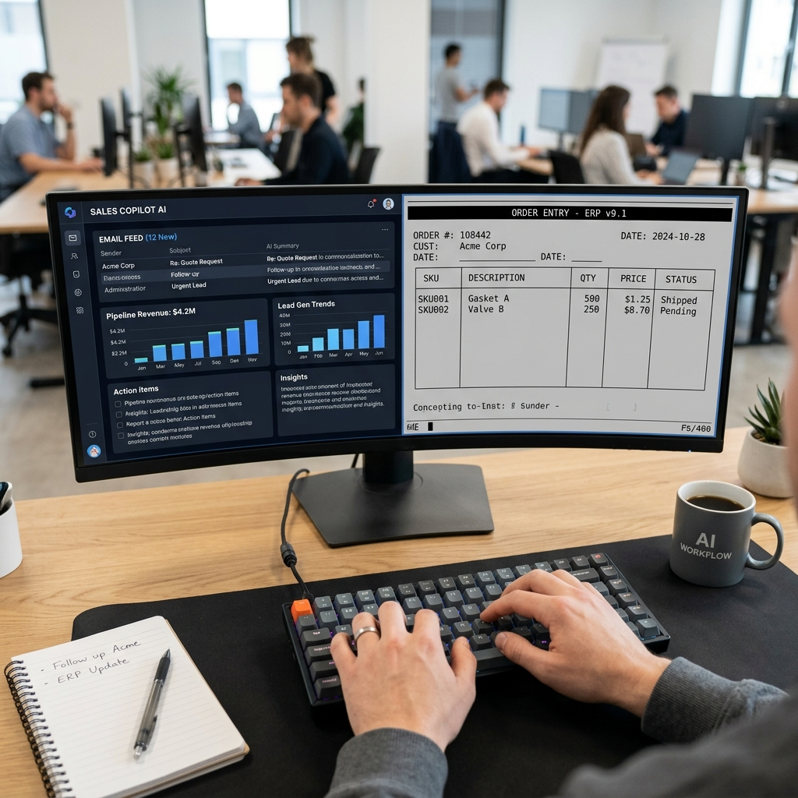

# Backfeed Live Demo Service (Render Deployable)

This repository contains the deployable package of the **Backfeed Cognitive Sales Platform** and **Eclipse ERP** integration, featuring an active security passcode gateway for public hosting.

---

## Workspace Setup (POV)

---

## Passcode Security Gate

Access to this deployment is gated. You must enter a valid passcode to unlock the Operations Center.

### How to Configure Passcodes on Render
1. Go to your Web Service dashboard on **Render**.
2. Navigate to **Environment**.
3. Add a new Environment Variable:
   - **Key**: `RENDER_PASSCODES`
   - **Value**: A comma-separated list of allowed passcodes (e.g., `BF-LIVE-DEMO,BF-PARTNER-7729,BF-GUEST-1102`).
4. If no `RENDER_PASSCODES` environment variable is defined, the gate defaults to `BF-LIVE-DEMO` on startup.

---

## Deploying to Render

This repository is optimized for one-click Docker deployments:

1. Create a new **Web Service** on Render.
2. Link this GitHub repository.
3. Render will automatically detect the `Dockerfile` and configure the environment:
   - **Runtime**: `Docker`
   - **Exposed Port**: Render will dynamically assign `PORT` (the server resolves this automatically).
4. Add the `RENDER_PASSCODES` environment variable under **Environment Settings** to define your custom keys.
5. Deploy. Once live, accessing the site will prompt visitors for their passcode to unlock the workspace.
